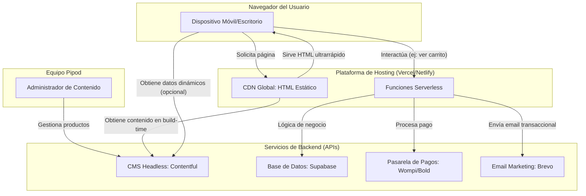

# Arquitectura Técnica del Proyecto Pipod

**Versión:** 1.0
**Fecha:** 2025-12-09
**Autor:** Gemini Code Assist

## 1. Resumen Ejecutivo

Este documento detalla la arquitectura de software para la plataforma de e-commerce de Pipod. El objetivo es migrar de un sistema monolítico tradicional (WordPress/WooCommerce) a una **arquitectura composable (headless)** moderna, priorizando el rendimiento, la escalabilidad, la seguridad y la reducción de costos operativos.

La arquitectura se basa en un conjunto de servicios especializados e independientes que se comunican a través de APIs, lo que nos permite construir un activo tecnológico propio, flexible y preparado para el crecimiento futuro.

## 2. Principios de Diseño

La arquitectura se rige por los siguientes principios clave:

-   **Rendimiento Primero (Performance-First):** La experiencia del usuario es primordial. El sitio debe cargar casi instantáneamente, incluso en redes móviles lentas, para maximizar la conversión y el posicionamiento SEO.
-   **Escalabilidad Serverless:** La infraestructura debe escalar automáticamente para manejar picos de tráfico sin intervención manual ni degradación del servicio.
-   **Seguridad por Diseño:** Minimizar la superficie de ataque desacoplando el frontend del backend y no exponiendo directamente la base de datos.
-   **Bajo Costo Operativo:** Aprovechar las capas gratuitas (`free tiers`) de los servicios PaaS/SaaS para mantener los costos de infraestructura cercanos a cero en las fases iniciales.
-   **Flexibilidad y Mantenibilidad:** Construir con "bloques de Lego" intercambiables. Si un servicio deja de ser adecuado, puede ser reemplazado sin tener que reconstruir toda la plataforma.

## 3. Diagrama de Arquitectura

El siguiente diagrama ilustra la interacción entre los componentes principales del sistema.



## 4. Componentes de la Arquitectura

### 4.1. Frontend: Astro

-   **Tecnología:** Astro
-   **Propósito:** Es el "constructor" de la interfaz de usuario. Se encarga de generar el sitio web que los usuarios ven y con el que interactúan.
-   **Justificación:**
    -   **Static Site Generation (SSG):** Astro renderiza las páginas a HTML puro durante el proceso de compilación (`build`). Este HTML se sirve desde una CDN, resultando en tiempos de carga extremadamente rápidos (TTFB bajo).
    -   **Arquitectura de Islas:** Por defecto, Astro no envía JavaScript al cliente. La interactividad (ej: un carrito de compras) se añade a través de "islas" de componentes (React, Vue, Svelte o JS puro), asegurando un rendimiento óptimo.
    -   **SEO Optimizado:** La velocidad y el HTML semántico generado por Astro son factores clave que Google premia en su ranking.

### 4.2. CMS Headless: Contentful

-   **Tecnología:** Contentful
-   **Propósito:** Es el "cerebro" del contenido. Actúa como un panel de administración donde el equipo de Pipod puede crear, actualizar y gestionar productos, categorías, precios e imágenes.
-   **Justificación:**
    -   **Desacoplamiento:** El contenido vive independientemente de la presentación (el frontend). Esto permite cambiar el diseño del sitio web sin tocar el contenido, y viceversa.
    -   **API-First:** Expone todo el contenido a través de una API REST/GraphQL robusta, que Astro consume durante el `build` para generar las páginas estáticas.
    -   **Seguridad y Facilidad de Uso:** Proporciona una interfaz amigable y segura para usuarios no técnicos, eliminando el riesgo de que modifiquen el código accidentalmente.

### 4.3. Base de Datos y BaaS: Supabase

-   **Tecnología:** Supabase (PostgreSQL)
-   **Propósito:** Es la "caja fuerte" para los datos estructurados y la lógica de negocio dinámica.
-   **Justificación:**
    -   **Base de Datos Relacional:** Utiliza PostgreSQL, una base de datos potente y fiable, ideal para almacenar historiales de compra, datos de usuarios, inventario y garantías.
    -   **Backend como Servicio (BaaS):** Provee funcionalidades listas para usar como autenticación de usuarios, almacenamiento de archivos y APIs autogeneradas.
    -   **Funciones Serverless (Edge Functions):** Permite ejecutar lógica de backend (ej: procesar un pago, validar un carrito) sin gestionar servidores. Estas funciones se usarán para las Fases 2 y 3.
    -   **Seguridad:** Incluye mecanismos de seguridad a nivel de fila (Row Level Security - RLS) para garantizar que los usuarios solo puedan acceder a sus propios datos.

### 4.4. Hosting y Despliegue: Vercel / Netlify

-   **Tecnología:** Vercel o Netlify
-   **Propósito:** Plataforma para compilar, desplegar y alojar el sitio web.
-   **Justificación:**
    -   **Integración con Git:** Se conecta directamente a un repositorio (GitHub, GitLab) y despliega automáticamente cada cambio en la rama principal.
    -   **CDN Global:** Distribuye el sitio estático a través de una red global, asegurando que los usuarios de cualquier parte del mundo tengan una experiencia rápida.
    -   **Entorno Serverless:** Proporciona la infraestructura para ejecutar las funciones serverless de Astro o Supabase.

### 4.5. Servicios de Terceros

-   **Pasarelas de Pago (Wompi/Bold):** Se integrarán a través de sus APIs desde funciones serverless para procesar transacciones de forma segura. Las claves secretas nunca se expondrán en el frontend.
-   **Email Marketing (Brevo):** Se usará para la captura de leads (Fase 1) y el envío de correos transaccionales (confirmación de compra, etc.) en fases posteriores, integrado vía API.

## 5. Modelado de Datos Inicial

### 5.1. Contentful: Modelo de Contenido

**Tipo de Contenido: `Producto`**

| Campo          | Tipo de Campo         | Descripción                                      |
| :------------- | :-------------------- | :----------------------------------------------- |
| `nombre`       | Texto (corto)         | Nombre del producto. Ej: "AirPods Pro 2da Gen".  |
| `slug`         | Slug                  | URL amigable. Ej: "airpods-pro-2da-gen".         |
| `descripcion`  | Texto (largo, RTF)    | Descripción detallada con formato.               |
| `precio`       | Número (Entero)       | Precio en COP.                                   |
| `sku`          | Texto (corto)         | Identificador único de inventario.               |
| `imagenes`     | Múltiples Archivos    | Galería de imágenes del producto.                |
| `categoria`    | Referencia (a `Categoria`) | Categoría a la que pertenece el producto.        |
| `enStock`      | Booleano              | Indica si el producto está disponible.           |

### 5.2. Supabase: Esquema de Base de Datos (Fase 2+)

```sql
-- Tabla para almacenar información de los usuarios
CREATE TABLE public.profiles (
  id UUID PRIMARY KEY REFERENCES auth.users(id) ON DELETE CASCADE,
  full_name TEXT,
  phone_number TEXT,
  updated_at TIMESTAMPTZ DEFAULT now()
);

-- Tabla para almacenar las órdenes de compra
CREATE TABLE public.orders (
  id BIGINT PRIMARY KEY GENERATED ALWAYS AS IDENTITY,
  user_id UUID REFERENCES public.profiles(id),
  total_amount INT NOT NULL,
  status TEXT DEFAULT 'pending', -- pending, completed, failed, shipped
  created_at TIMESTAMPTZ DEFAULT now(),
  payment_gateway_ref TEXT
);

-- Tabla para los ítems dentro de cada orden
CREATE TABLE public.order_items (
  id BIGINT PRIMARY KEY GENERATED ALWAYS AS IDENTITY,
  order_id BIGINT REFERENCES public.orders(id) ON DELETE CASCADE,
  product_sku TEXT NOT NULL,
  quantity INT NOT NULL,
  unit_price INT NOT NULL
);
```

## 6. Flujo de Desarrollo y Despliegue (CI/CD)

1.  **Repositorio:** Todo el código fuente del frontend residirá en un repositorio de Git (ej: GitHub).
2.  **Ramas:**
    -   `main`: Contiene el código en producción. Cada `push` a esta rama dispara un despliegue automático a `pipod.com`.
    -   `develop`: Rama de integración para nuevas funcionalidades.
    -   `feature/*`: Ramas individuales para cada nueva característica o corrección.
3.  **Desarrollo Local:** El desarrollador ejecuta el sitio de Astro localmente, que obtiene datos de la API de Contentful.
4.  **Pull Request:** Al completar una característica, se crea un Pull Request (PR) de la rama `feature/*` a `develop`. Vercel/Netlify generará una URL de vista previa para revisar los cambios.
5.  **Merge y Despliegue:** Una vez aprobado, el PR se fusiona. Para lanzar a producción, se fusiona `develop` en `main`, lo que inicia el despliegue final.

## 7. Estrategia de Seguridad

-   **Variables de Entorno:** Todas las claves de API, tokens y secretos (`CONTENTFUL_API_KEY`, `SUPABASE_ANON_KEY`, `WOMBPI_SECRET_KEY`, etc.) se gestionarán como variables de entorno en Vercel/Netlify, nunca se expondrán en el código del frontend.
-   **APIs Seguras:** Las operaciones sensibles (pagos, creación de órdenes) se realizarán exclusivamente a través de funciones serverless, que actúan como un backend seguro.
-   **Supabase RLS:** Se configurará Row Level Security en la base de datos para que un usuario autenticado solo pueda consultar o modificar sus propios datos (ej: su historial de compras).
-   **Ataques a CMS:** La arquitectura headless elimina por completo los vectores de ataque comunes en WordPress (plugins vulnerables, inyección SQL a través de formularios, etc.), ya que el CMS no está conectado directamente a la web pública.
